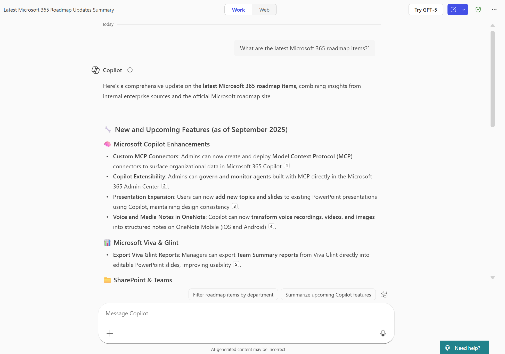

# Microsoft 365 Roadmap Connector

## Summary

This custom Copilot Connector for Microsoft 365 Roadmap will help you bring Microsoft 365 Roadmap data into Microsoft 365 Copilot. Once ingested, you can ask Copilot about the latest roadmap items. You can use the connection 'M365Roadmap' in your Copilot agents as a knowledge source.

The connector fetches roadmap items from `https://www.microsoft.com/releasecommunications/api/v1/m365` and processes the JSON data output. It does a full crawl once a day and incrementally crawls every 15 minutes to keep the data up to date.

This connector was built using the [Microsoft 365 Agents Toolkit for Visual Studio Code](https://marketplace.visualstudio.com/items?itemName=TeamsDevApp.ms-teams-vscode-extension). It provides an end-to-end opinionated starting point for creating a connector, ingesting content, and refreshing the ingested content.

## Prerequisites

- [Microsoft 365 Agents Toolkit for Visual Studio Code](https://marketplace.visualstudio.com/items?itemName=TeamsDevApp.ms-teams-vscode-extension)
- [Azure Functions Visual Studio Code extension](https://marketplace.visualstudio.com/items?itemName=ms-azuretools.vscode-azurefunctions)
- [Microsoft 365 Developer tenant](https://developer.microsoft.com/microsoft-365/dev-program) with [uploading custom apps enabled](https://learn.microsoft.com/microsoftteams/platform/m365-apps/prerequisites#prepare-a-developer-tenant-for-testing)
- [Node.js](https://nodejs.org/), supported versions: 18, 20, 22
- Have the ability to admin consent in Entra Admin Center. See [Grant tenant-wide admin consent to an application](https://learn.microsoft.com/en-us/entra/identity/enterprise-apps/grant-admin-consent?pivots=portal#prerequisites) for the required roles

## Minimal path to awesome - Debug against a real Microsoft 365 tenant

- Create the project by **Microsoft 365 Agents Toolkit** 
- Fill env file in `env` folder
  - Open the `.env.local`. Update the `JSON_API_URL` value (default is already set)
- Press <kbd>F5</kbd>, follow the sign in prompts
- When prompted, click on the link in the console to perform the tenant-wide admin consent
- Wait for all tasks to complete
- In the web browser navigate to the [Copilot Connectors](https://admin.microsoft.com/#/copilot/connectors) area in the Microsoft 365 Admin Center
- A table will display available connections. Locate the **Microsoft 365 Roadmap** connection. In the **Required actions** column, select the link to **Include Connector Results** and confirm the prompt
- Navigate to [Microsoft 365 Copilot](https://m365.cloud.microsoft/chat)
- Using the search box on top, search for: `What are the latest Microsoft 365 roadmap items?`. You should see the following result:



> [!NOTE]  
> It can take a moment for the results to appear. If you don't see the results immediately, wait a few moments and try again.
> If you are getting results from the web, you can turn off web for better isolation of your connector results.

## Running the Connector

### Prerequisites
Set the environment variable:
```bash
JSON_API_URL=https://www.microsoft.com/releasecommunications/api/v1/m365
```

### Deployment in Azure

To deploy the connector in Azure, you need to follow these steps:

- Fill env file in `env` folder for dev environment
  - Open the `.env.dev`. The `JSON_API_URL` and `CONNECTOR_ID` values should already be configured
- Go to **Microsoft 365 Agents Toolkit** `Lifecycle` tab and select **Provision**. This will create the Azure resources needed for the connector
- Go to **Microsoft 365 Agents Toolkit** `Lifecycle` tab and select **Deploy**. This will deploy the Azure Function application with the connector code

Once the deployment is finished, you can go to the Azure portal and navigate to the Azure Function application. You will see three functions created:
- `deployConnection`: This function is run once per day and it ensures that the connection is up to date. Run it manually if you want to accelerate crawling since it is needed to run, at least once, for the other functions to work.
- `fullCrawl`: This function is run once per day and it ensures that all the content is crawled. Run it manually if you want to test in advance.
- `incrementalCrawl`: This function is run every 15 minutes and it ensures that the content is updated. You can run it manually as well.

### lastCrawl checkpoint file

The connector keeps track of the last successful crawl time in a small checkpoint file so that incremental crawls only request recent changes. Locally this file is stored at `tmp/lastCrawl.json`.

If you want to force a full crawl (for example to re-index all items), delete the checkpoint file before running a crawl. Example commands:

PowerShell:

```powershell
Remove-Item .\tmp\lastCrawl.json -ErrorAction SilentlyContinue
```

Bash / macOS / Linux:

```bash
rm -f tmp/lastCrawl.json
```

When the file is absent the connector will treat the next run as a full crawl and re-ingest all content.

*Note*: For Azure based deployments, it is needed to give admin consent to the permissions of the connector app for this deployment. You can find the Application (Client) ID of this application looking into `AZURE_CLIENT_ID` environment variable defined for the Azure Function application.

### Troubleshooting: Storage account key access (403 KeyBasedAuthenticationNotPermitted)

Cause
- The Function App fails with: 403 KeyBasedAuthenticationNotPermitted.
- This happens when the storage account used by Azure Functions has shared-key access disabled, and the Functions runtime is still configured to use key-based authentication (AzureWebJobsStorage).

Compatibility note
- Ensure that your storage account is compatible with the Shared Key access feature. The account must be a General Purpose v2 (GPv2) or a Block Blob storage account. If your account is a different type (for example, GPv1 or certain premium account types), the "Allow storage account key access" setting may not be applicable.

Quick fix (recommended for immediate recovery)
1. In the Azure Portal, open the Storage account used by your Function App.
2. Go to Configuration.
3. Enable "Allow storage account key access" (setting name: allowSharedKeyAccess) and Save.
4. Restart the Function App from the Azure Portal.
5. Verify the Function App logs; the listener for the function (for example `fullCrawl`) should start without the 403 error.

Long-term (recommended): switch AzureWebJobsStorage to identity-based access
- Rationale: shared keys present a higher risk for long-lived credentials. Use a managed identity for the Function App and grant it access to the Storage account. The managed identity obtains tokens from Azure AD and uses role-based access to Storage.

Steps (examples)

1) Enable a system-assigned managed identity on the Function App

Azure CLI
```bash
# replace placeholders: <FUNC_NAME>, <FUNC_RG>
az functionapp identity assign --name "<FUNC_NAME>" --resource-group "<FUNC_RG>"
```

PowerShell (run in pwsh; using Azure CLI inside PowerShell)
```powershell
# replace placeholders: <FUNC_NAME>, <FUNC_RG>
az functionapp identity assign --name "<FUNC_NAME>" --resource-group "<FUNC_RG>"
```

2) Obtain the Function App principalId and the Storage account resource id

Azure CLI
```bash
PRINCIPAL_ID=$(az functionapp show -n "<FUNC_NAME>" -g "<FUNC_RG>" --query identity.principalId -o tsv)
STORAGE_ID=$(az storage account show -n "<STORAGE_ACCOUNT_NAME>" -g "<STORAGE_RG>" --query id -o tsv)
echo "PrincipalId: $PRINCIPAL_ID"
echo "StorageId: $STORAGE_ID"
```

PowerShell
```powershell
$principalId = az functionapp show -n "<FUNC_NAME>" -g "<FUNC_RG>" --query identity.principalId -o tsv
$storageId   = az storage account show -n "<STORAGE_ACCOUNT_NAME>" -g "<STORAGE_RG>" --query id -o tsv
Write-Host "PrincipalId: $principalId"
Write-Host "StorageId: $storageId"
```

3) Grant the managed identity a role on the Storage account (example: Storage Blob Data Contributor)

Azure CLI
```bash
az role assignment create --assignee "$PRINCIPAL_ID" --role "Storage Blob Data Contributor" --scope "$STORAGE_ID"
```

PowerShell
```powershell
az role assignment create --assignee $principalId --role "Storage Blob Data Contributor" --scope $storageId
```

4) Configure the Function App to use identity-based authentication for runtime storage
- The final step is to update the Function App configuration so the Functions runtime uses your managed identity instead of a storage account key. See the official docs for the authoritative runtime configuration steps; they include guidance for Storage triggers and bindings when using managed identities.

Helpful references (follow these for the precise runtime configuration steps):
- Azure Functions managed identity overview:
  https://learn.microsoft.com/azure/azure-functions/functions-managed-identity
- Authorize access to Azure Storage with Azure AD:
  https://learn.microsoft.com/azure/storage/blobs/authorize-access-azure-active-directory
- Functions guidance for identity-based storage / triggers (see the Storage trigger docs for identity-based examples):
  https://learn.microsoft.com/azure/azure-functions/functions-bindings-storage-blob-trigger

Notes
- The az commands above are safe to run from your local shell (pwsh) after you've authenticated with `az login` and selected the correct subscription via `az account set --subscription <SUB_ID>`.
- After you configure identity-based access, remove or rotate old storage account keys in app settings (do this carefully — ensure the Functions runtime is fully switched to identity-based auth first).
- You can also use a user-assigned managed identity instead of a system-assigned one; the commands differ slightly (you must create/assign the user-assigned identity and pass the clientId to the Function App configuration).
